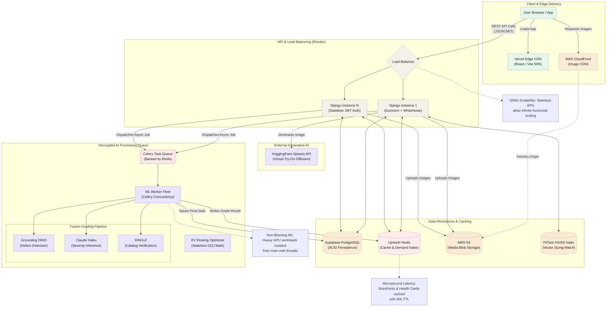

# System Architecture Diagram

> **Instructions for the PRD:** You can copy this code block into any Mermaid-supported Markdown editor (like Notion, GitHub, or Obsidian) to instantly render the diagram. There are also free tools like [Mermaid Live Editor](https://mermaid.live/) where you can paste this code, customize the colors, and download it as a high-quality PNG/SVG for your Word document.

