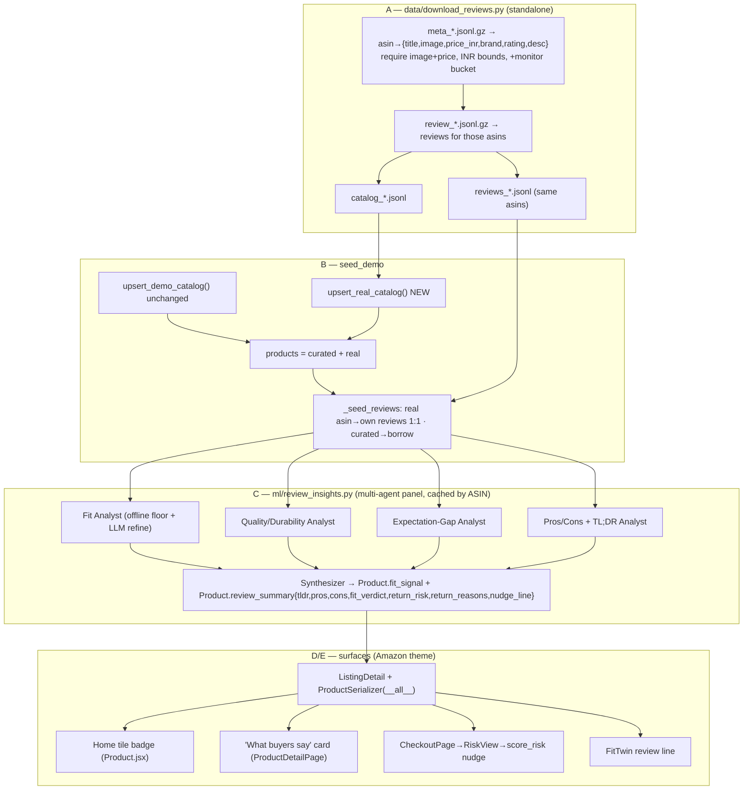

# REVIVE — Real Amazon catalog + multi-agent review intelligence for return prevention

## Context

The storefront seeds entirely from `_demo_catalog.py`: ~150 curated branded products mapped to
~18 stock Unsplash images, so dozens of phones share three photos. Reviews are real Amazon
Reviews 2023 data, but because the curated products don't exist in the dataset, `seed_demo`
attaches a *different* real ASIN's reviews by category — the reviews on a page don't belong to
the product shown.

`data/download_reviews.py` already streams the real **metadata** file to title-ground each
product (and filters out women's/girls'/accessory items), but discards the real `images`,
`price`, `store`, and `rating` it reads. We keep those, make real Amazon products a **second
catalog source** (real image + real title + that product's **own** reviews), then run a
**multi-agent review panel** over each product's reviews to (a) drive a Pillar-4 return-risk
signal and (b) render an Amazon-native "What buyers say" experience across the home grid,
product page, checkout, and FitTwin.

**Decisions (user-confirmed):**
1. **Augment, not replace.** Keep `_demo_catalog.py` (it guarantees Sell-It catalog search in
   `CatalogSuggestView` + recognizable demo brands). **Add** real Amazon ASINs alongside it.
   Real products get their own ASIN's reviews 1:1; curated products keep today's borrowing.
2. **Wire the checkout nudge fully.** `ReturnNudge.jsx` and `/api/prevent/risk/` are mounted
   nowhere today; Part C/E mount them and resolve listing→product+`fit_signal` in `RiskView`.

Vocabulary: the mined fit signal uses `runs_small | runs_large | true_to_size` to match the
existing `FitTwin.jsx` `DIRECTION` map and `prevent/fit_profile.py` `BRAND_BIAS`.

---

## Part A — ETL: keep the real metadata the stream already reads
File `data/download_reviews.py` (standalone — cannot import the Django `import_amazon_data`
module, so replicate its tiny helpers).

- **`_collect_good_asins` → return product records** `{asin: {title, image, price_inr, brand,
  avg_rating, rating_number, description}}` instead of `{asin: title}`. Read fields as
  `import_amazon_data.py` does: image via a ported `_first_image` preferring `hi_res → large →
  thumb`; price via ported `_price` (`float(...) * 83.0`); brand `m.get("store")`; description via
  ported `_desc`; `average_rating`/`rating_number`. **Require image AND price**, then per-bucket
  INR bounds (phone ₹5k–150k, laptop ₹20k–300k, monitor ₹8k–80k, footwear ₹1k–20k, apparel
  ₹300–8k). Define `USD_TO_INR=83.0` + `BOUNDS` at top.
- **Add a `monitor` bucket** (`Electronics.jsonl.gz`): `need` = monitor, display, ultrasharp,
  "led monitor", "ips monitor"; `avoid` = mount, arm, stand, cable, riser, hub, privacy, filter,
  cleaner, tv, soundbar, mouse, keyboard, webcam, speaker, dock, adapter.
- **`fetch_bucket`:** after the review pass yields the `qualifying` ASIN set, write `reviews_{bucket}.jsonl`
  (unchanged) **and** `catalog_{bucket}.jsonl` (NEW: `asin,title,brand,price_inr,image,avg_rating,
  rating_number,description` per qualifying ASIN). Same ASIN set in both → exact 1:1 join.
- **Add `--local DIR`** to gzip-open local `meta_*.jsonl.gz`/`*.jsonl.gz` instead of streaming.

---

## Part B — Add the real catalog + 1:1 reviews (alongside curated)

### B1. NEW `backend/core/management/commands/_real_catalog.py`
`upsert_real_catalog()` reads `data/catalog_*.jsonl` (bucket→category: phone→Phone, laptop→Laptop,
monitor→Monitor, footwear→Footwear, apparel→Apparel). Per record:
`Product.update_or_create(asin=asin, defaults=…)` with real title/brand/`mrp=price_inr`/
`reference_image_url=image`/description/`rating=avg_rating`/`rating_count=rating_number`, then a NEW
`Listing` at MRP (reuse `import_amazon_data._new_listing`). Skip a bucket whose file is absent.
Return the product list.

### B2. `seed_demo.py` — augment, don't replace
- After `products = upsert_demo_catalog()`, also call `upsert_real_catalog()` and concatenate.
  Downstream (second-life, fit items, health cards, demo orders) already operates on the combined
  list — no change.
- Add `"monitor": "Monitor"` to `REVIEW_BUCKETS`.
- **`_seed_reviews` split:** build `by_asin` per bucket as today. For each target product: if
  `p.asin` is a real ASIN present in `by_asin` → attach that exact set 1:1 (skip the borrowing /
  `_apparel_group` / `_ptitle_ok` / `_asin_is_wrong` gates — identity is exact); else (curated
  `DEMO-xxx`) → keep the existing assignment unchanged. Keep `_display_name`, rating recompute,
  verified/helpful mapping for both.
- Demo hero `_pick(...)` brand literals (`"iPhone 14"` etc.) won't match real titles but `_pick`
  already falls back to highest-MRP-in-category, so all five flows resolve — simplify to plain
  category picks.
- Update `seed_demo` docstring + `progress.md` to "curated + real Amazon data, 1:1 reviews".

### B3. FitTwin linkage — `assign_fit_items.py`: no change (already assigns over any apparel/footwear).

---

## Part C — Multi-agent review panel (the Pillar-4 brain)
NEW `ml/review_insights.py`. Runs **once at seed time, cached by ASIN** to
`ml/artifacts/review_summary_cache.json` (mirrors `captioner._load_cache`/`_save_cache`), so it's
free at request time and **fail-open** offline.

**Panel of specialist roles** (this is the "multi-agent" path — each role has a focused remit and
its own structured output; a synthesizer merges them):
- **Fit Analyst** — sizing/fit. Deterministic floor = `mine_fit_signal(reviews)` (offline regex over
  `title+body`: "runs small/large", "size up/down", "true to size", "tight/snug", "loose/roomy" →
  signed vote → `{direction, confidence, mentions}`). When a key is present, an LLM pass refines
  direction/verdict; offline, the regex result stands.
- **Quality/Durability Analyst** — defects, longevity, "stopped working", battery — the dominant
  return driver for electronics.
- **Expectation-Gap Analyst** — "not as described/pictured", wrong color/material — the dominant
  non-sizing return driver for apparel/footwear.
- **Pros/Cons + TL;DR Analyst** — concise `pros[]`, `cons[]`, one-line `tldr` for the card.
- **Synthesizer** — merges the above into the persisted payload **and** a Pillar-4 return signal.

**Execution model (best path):** default = a **single cached structured call** where the model is
prompted to fill every specialist section in one JSON (cheap, ~250 products once, reuses the
OpenRouter client + `_parse_json_response` pattern from `ml/captioner.py::_caption_openrouter`,
text-only). Add a flag `REVIEW_PANEL_MULTI=1` for a true fan-out (one call per specialist + a synth
call) for the showcase. Both write the same schema. No key → deterministic offline result
(`fit_signal` from the regex; `review_summary` with empty LLM fields but a heuristic `return_risk`
from category prior + fit-signal strength).

**Outputs persisted on `Product`:**
- `fit_signal` = `{direction, confidence, mentions}` (apparel/footwear only).
- `review_summary` = `{tldr, pros[], cons[], fit_verdict, return_risk: 0–1,
  return_reasons: [{reason, share}], nudge_line}` (all graded categories). `nudge_line` is the
  ready-to-show checkout sentence, e.g. *"Buyers say this runs small — consider sizing up."*

### C-models. `backend/core/models.py` + migration `0009_*` (last is `0008_review.py`)
Add `Product.fit_signal = JSONField(null=True, blank=True)` and
`Product.review_summary = JSONField(null=True, blank=True)`. In `seed_demo._seed_reviews`, right
after a product's reviews attach, call the panel, store both fields, and `bulk_update` them with
`rating`.

### C-api. `backend/core/views.py` `ListingDetailView`
In the ratings/reviews block (~360–376) add `data['review_summary'] = listing.product.review_summary`
and `data['fit_signal'] = listing.product.fit_signal`. (Also auto-present under `listing.product`
because `ProductSerializer` is `__all__` — list endpoints get them for free, which Part D uses.)

---

## Part D — Screens & Amazon-theme presentation
Reuse existing tokens so everything reads as native Amazon: bg `#EAEDED`, cards white +
`#D5D9D9` border, teal link `#007185`, gold `#FF9900`/`#febd69`, navy `#232F3E`, success `#007600`,
grade pills (`GRADE_STYLES`).

### D1. Home grid tile — `frontend/src/components/Product.jsx` (+ `HomePage.jsx` plumbing)
- `HomePage.jsx` product map: add `fit_signal: l.product.fit_signal` and
  `review_summary: l.product.review_summary`; pass both into `<Product>`.
- In `Product.jsx`, two small, theme-matched signals (both pre-empt returns at browse time):
  - **Fit pill** when `fit_signal && direction !== 'true_to_size'`: a `Runs small`/`Runs large`
    pill in the existing orange grade style (`bg-[#fbe9dd] text-[#bd4a17]`), placed under the title
    near the stars.
  - **Keep-rate trust line** when `review_summary.return_risk` is low (< 0.2): a `#007185` micro-line
    *"✓ 9 in 10 buyers keep this"* (derive from `1 - return_risk`). Amazon-style reassurance that
    advances the Pillar-4 story on the grid.
- Keep tiles lean: only read the two small fields; ignore the rest.

### D2. Product page "What buyers say" card — `frontend/src/pages/ProductDetailPage.jsx`
Rendered just above `<ReviewsSection>` (near line 686), only if `review_summary` or `fit_signal`
present. Native composition:
- White card, `#D5D9D9` border, rounded, `mt-4` (matches `ReviewsSection` shell at line 79).
- Header row: **"What buyers say"** + an **AI pill** reusing RecommendationRail's style
  (`bg-[#232F3E] text-[#febd69]`, line 31).
- `tldr` one-liner; then two columns — **Pros** (each with a `#007600` check) / **Cons** (muted
  `#565959`), from `review_summary.pros/cons`.
- **Fit & sizing callout**: reuse the exact "AI Condition Notes" pattern
  (`border-l-4 border-[#FF9900] bg-[#FFFBF0]`, lines 357–367) showing `fit_verdict`/`fit_signal`.
- Optional **"Why people return this"** chips from `return_reasons` (top 2), small gray pills —
  reinforces the return-prevention theme transparently.

### D3. Checkout — `CheckoutPage.jsx` + `ReturnNudge.jsx`
Mount the currently-unused nudge (Part E wires the fetch). Styling already matches Amazon (amber/
blue boxes); the review-derived `nudge_line` renders in the blue box. Keep the existing
multi-size inline nudge above it.

### D4. FitTwin — `frontend/src/components/stitch/FitTwin.jsx`
Pass `fit_signal` from `ProductDetailPage`'s `<FitTwin>` and render a review-derived line under the
brand-bias row (reuse the gray pill row at lines 121–129): *"Buyers report this runs small."*

---

## Part E — Checkout nudge wiring (fold review intel into the existing prevent path)
- **`backend/prevent/views.py` `RiskView`:** accept `cart: [{listing_id, size}]`. Resolve each via
  `Listing.objects.select_related('product').get(pk=listing_id)` → build `score_risk` item
  `{product_id, category, brand, size, fit_signal, review_summary}`. Tolerate the legacy raw-dict
  shape; skip missing listings.
- **`ml/prevent.py` `score_risk`/`_nudge_text`:** if an item has `review_summary.return_risk`, blend
  it into that line's risk (e.g. `max(heuristic, review_risk)` or weighted); if `fit_signal.direction
  != 'true_to_size'`, bump risk by `0.12 * confidence` and prefer `review_summary.nudge_line` (else the
  fit sentence) as `nudge_text`. Keep the return signature unchanged.
- **`frontend/src/pages/CheckoutPage.jsx`:** on cart change, `POST /api/prevent/risk/` with
  `cart: cart.map(it => ({ listing_id: it.id, size: it.size }))`; import + mount
  `<ReturnNudge risk={riskData} />` in the cart column.

---

## Critical files
- `data/download_reviews.py` — image/price/brand kept; `monitor` bucket; `catalog_*.jsonl`; `--local`.
- NEW `data/catalog_{phone,laptop,monitor,footwear,apparel}.jsonl` (generated).
- NEW `backend/core/management/commands/_real_catalog.py`.
- `backend/core/management/commands/seed_demo.py` — real catalog + 1:1 review split; panel call.
- NEW `ml/review_insights.py` — multi-agent panel (cached, offline-safe), reuses `ml/captioner.py`.
- `backend/core/models.py` (+`fit_signal`, +`review_summary`) + migration `0009_*`.
- `backend/core/views.py` (`ListingDetailView` payload).
- `ml/prevent.py`, `backend/prevent/views.py` (review intel → nudge/risk; listing→product resolve).
- `frontend/src/components/Product.jsx`, `frontend/src/pages/HomePage.jsx` (home tile signals).
- `frontend/src/pages/ProductDetailPage.jsx` ("What buyers say" card; fit_signal → FitTwin).
- `frontend/src/pages/CheckoutPage.jsx`, `frontend/src/components/stitch/ReturnNudge.jsx`, `FitTwin.jsx`.
- `progress.md`.

## Data acquisition / preconditions
- **Default:** `python data/download_reviews.py` streams + early-stops all five buckets, writing
  `catalog_*.jsonl` + `reviews_*.jsonl`. The existing `reviews_*.jsonl` (old code, no catalog, no
  monitor bucket) **must be regenerated** so ASIN sets align. Needs outbound access to
  `mcauleylab.ucsd.edu`; if blocked by the env network policy, use `--local`.
- **Manual:** download per-category `raw_meta_<Cat>.jsonl.gz` + `<Cat>.jsonl.gz` from the McAuley Lab
  Amazon-Reviews-2023 dataset, then `python data/download_reviews.py --local <folder>`. Categories:
  `Cell_Phones_and_Accessories`, `Electronics` (laptops + monitors), `Clothing_Shoes_and_Jewelry`.
- LLM panel (`summarize_reviews`/refine) needs `OPENROUTER_API_KEY` in `backend/.env`; without it the
  card shows the offline fit signal + heuristic return_risk only. `REVIEW_PANEL_MULTI=1` enables true
  fan-out.

## Verification
1. `python data/download_reviews.py` → five `catalog_*.jsonl` + `reviews_*.jsonl`; spot-check catalog
   lines have a real `https` image, sane INR price, brand; `grep -iE 'women|girls|ladies'
   data/catalog_{footwear,apparel}.jsonl` → no hits.
2. `cd backend && python manage.py migrate && python manage.py seed_demo` → reports curated + real
   counts; two real same-brand products show different photos + different review sets; a product's
   reviews are its own ASIN's; `Product.review_summary`/`fit_signal` populated.
3. Home grid: apparel/footwear that run small show the `Runs small` pill; low-return items show the
   keep-rate line — both theme-native.
4. Product page: "What buyers say" card (AI pill, TL;DR, pros/cons, `#FF9900` fit callout, return-reason
   chips) renders above reviews.
5. Add a `runs_small` tee/shoe to cart → `CheckoutPage` shows the review-derived `ReturnNudge`; FitTwin
   corroborates on the product page.
6. `python manage.py check` → 0 issues; `cd frontend && npm run build` → clean.
7. Hero flows still work on real ASINs (return phone/laptop/monitor, Sell-It a shoe, VTON a tee,
   FitTwin on apparel); Sell-It catalog search still finds curated brands.